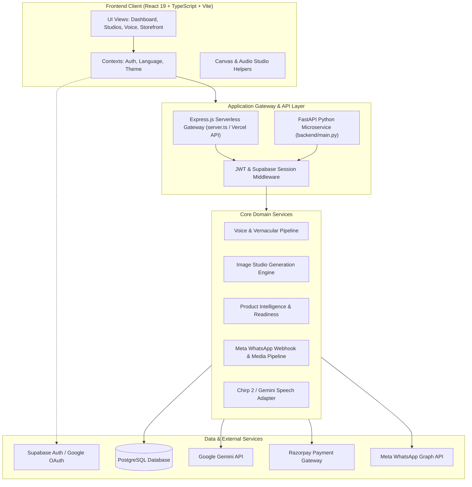
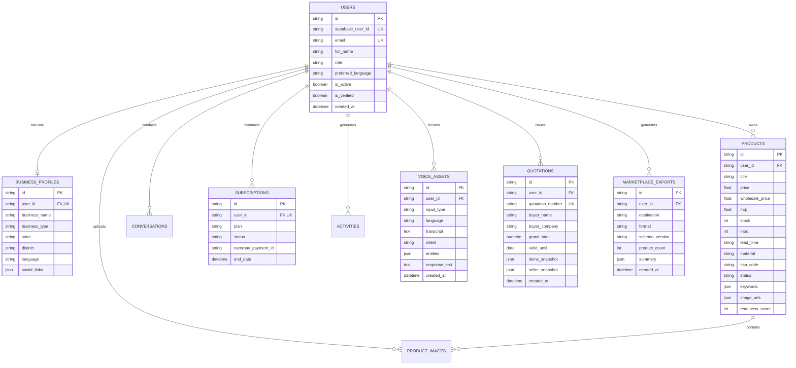
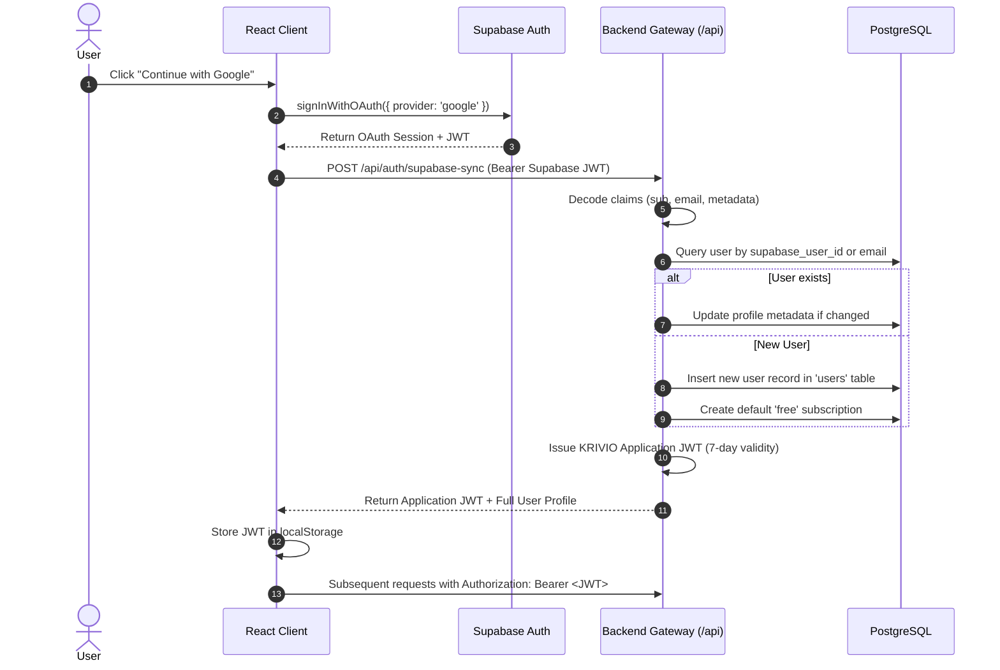
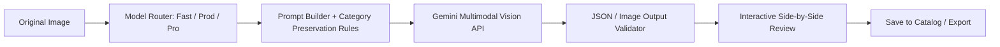

# KRIVIO AI — Architecture

This document provides a comprehensive technical reference for the architecture, data models, AI pipelines, external integrations, and deployment configurations of the KRIVIO AI platform.

For feature-specific workflows, see [FEATURES.md](FEATURES.md). For security policies, see [SECURITY.md](SECURITY.md).

---

## 1. System Overview

KRIVIO AI is built as a hybrid cloud architecture designed to provide low-latency, context-aware digital business assistance for rural entrepreneurs.

The system combines:
1. A reactive, multilingual **React 19 Frontend** with client-side canvas editing and Web Audio recording.
2. A dual-engine backend topology:
   - **Express.js / Node.js Gateway (`server.ts`):** Serves API routes, handles SSR/Vite dev middleware, executes image processing pipelines, and deploys to Vercel serverless functions.
   - **FastAPI / Python Service (`backend/`):** High-throughput microservice handling WhatsApp webhooks, background media pipelines, and Google Cloud Speech adapters.
3. **PostgreSQL Database:** Relational persistent layer enforcing strict tenant isolation across users, profiles, products, images, and voice assets.
4. **Google Gemini AI Engine:** Multimodal foundation models executing computer vision, speech transcription, intent extraction, and multilingual generation.

---

## 2. Architecture Principles

- **Context-Grounded AI:** AI prompts are dynamically infused with the entrepreneur's verified business profile, craft heritage, region, and existing catalog items to prevent hallucinations and generic advice.
- **Tenant Isolation by Default:** Every database record is linked to a validated `user_id`. Queries are explicitly scoped to the authenticated user derived from verified JWT claims.
- **Graceful Fallbacks:** The platform maintains local deterministic fallbacks for network interruptions, vernacular translations, and missing AI credentials.
- **Separation of Presentation and Orchestration:** Heavy multimodal AI calls are executed server-side to protect API keys and apply validation before persistence.

---

## 3. High-Level Architecture Diagram



---

## 4. Frontend Architecture

The frontend is a Single Page Application (SPA) built with **React 19**, **TypeScript 5.8**, and **Vite 6**.

### 4.1 State Management & Context Hierarchy
The application wraps top-level views in three contextual providers:
1. `LanguageProvider (`src/i18n/LanguageContext.tsx`):` Manages active locale, language selection persistence in `localStorage`, and key-based translation interpolation across 7 supported Indian languages.
2. `ThemeProvider (`src/context/ThemeContext.tsx`):` Coordinates dark/light theme classes and persistence.
3. `AuthProvider (`src/context/AuthContext.tsx`):` Subscribes to Supabase OAuth state changes (`onAuthStateChange`), synchronizes credentials with the backend `/api/auth/supabase-sync` endpoint, and manages session tokens.

### 4.2 Component Organization
```
src/components/
├── AuthModal.tsx             # Modal with Google OAuth & Email authentication
├── Dashboard.tsx             # Primary entrepreneur command center
├── ErrorBoundary.tsx         # React class error boundary preventing white-screens
├── Footer.tsx                # Site footer, legal modals (Privacy, Terms), trust badges
├── GovernmentSchemes.tsx     # Central and state MSME scheme discovery view
├── ImageStudio.tsx           # Legacy vision analysis view
├── LandingPage.tsx           # Public showcase page with hero, testimonials, pricing
├── LanguageSelector.tsx      # Language dropdown with vernacular scripts
├── MarketplaceReadiness.tsx  # Catalog auditing view for ONDC, Amazon, Meesho, Etsy
├── Navbar.tsx                # Responsive top navigation with quick-actions
├── PricingModal.tsx          # Subscription plan upgrade interface (Razorpay)
├── ProductIdentityWizard.tsx # Multi-step AI catalog creation wizard
├── ProductStudio.tsx         # Product inventory management & editing
├── PublicStorefront.tsx      # Direct shareable customer-facing catalog
├── SettingsView.tsx          # Entrepreneur profile & notification preferences
├── VoiceMentor.tsx           # Voice-first AI business mentor workspace
└── image-studio/
    └── StudioWorkspace.tsx   # Canvas-based photo editing & generative layer workspace
```

### 4.3 Image Studio Canvas Engine (`src/utils/studioCanvasHelper.ts`)
The studio leverages an HTML5 Canvas pipeline capable of:
- Preserving natural aspect ratios while applying high-resolution scaling.
- Compositing background removals, drop shadows, gradient lighting, and promotional badges.
- Exporting lossless WebP/PNG data buffers directly to the catalog storage pipeline.

---

## 5. Backend Architecture

KRIVIO AI uses a dual backend architecture to optimize for both serverless web hosting and long-running media workflows:

### 5.1 Express.js Server (`server.ts`)
- **Primary Role:** Unified API gateway, static asset serving, and Vite development middleware.
- **Build Pipeline:** Bundled with `esbuild` into `dist/server.cjs` for execution on Node.js runtimes and Vercel serverless functions (`api/index.ts`).
- **Database Access:** Uses `pg` (node-postgres) connection pooling with parameterized SQL queries.

### 5.2 FastAPI Python Microservice (`backend/`)
- **Primary Role:** High-throughput processing for asynchronous WhatsApp webhooks, audio media downloads, and speech engine adaptations.
- **Routing Structure:**
  - `auth_router (`backend/routes/auth.py`)` — Session synchronization and user identity lookup.
  - `voice_router (`backend/routes/voice.py`)` — Vernacular audio transcription, intent classification, and TTS synthesis.
  - `whatsapp_router (`backend/routes/whatsapp.py`)` — Meta Webhook challenge verification (`GET`), inbound message dispatch (`POST`), and system diagnostics.
  - `product_router (`backend/routes/product.py`)` — Product CRUD, duplication, archiving, and AI detail generation.
  - `business_profile_router (`backend/routes/business_profile.py`)` — Craft profile and heritage storytelling.
  - `dashboard_router (`backend/routes/dashboard.py`)` — Analytics aggregation and activity logs.

---

## 6. Data Architecture (PostgreSQL)

The database schema enforces relational integrity and cascading deletes across all user-owned entities.



### 6.1 Entity Overview
- **`users`:** Primary account record mapped directly to Supabase authentication IDs or internal credentials.
- **`business_profiles`:** Entrepreneur's enterprise identity (craft category, artisan story, location, social links, GST number).
- **`products`:** Canonical catalog items containing retail and wholesale pricing, dimensions, packaging weight, MOQs, materials, HSN codes, and images.
- **`quotations`:** Formal wholesale B2B quotations with immutable seller/product snapshots, calculated totals, and terms.
- **`marketplace_exports`:** Audit log of multi-channel listing files generated for Amazon, Meesho, Flipkart, ONDC, and generic CSV/XLSX.
- **`product_images`:** Image asset references linked to parent products.
- **`conversations`:** Persistent AI mentor discussion threads stored with timestamped message JSON arrays.
- **`voice_assets`:** Audit log of all spoken interactions, audio metadata, intent classifications, extracted entities, and synthesized replies.
- **`subscriptions`:** Subscription tier tracking (`free` vs `pro`), expiration dates, and Razorpay transaction IDs.
- **`activities`:** Chronological feed of user actions for dashboard timeline visualization.
- **`government_schemes`:** Reference table of national and regional MSME schemes, eligibility criteria, and official portal links.

---

## 7. Authentication & Authorization Flow

KRIVIO AI uses a hybrid authentication pattern combining Supabase Auth with custom application JWTs:



---

## 8. AI Architecture & Multimodal Pipelines

The platform utilizes **Google Gemini** models routed through specialized prompt engineering and schema validation layers:

### 8.1 Image Studio Pipeline


### 8.2 Voice Interaction Pipeline
1. **Capture:** In-app Web Audio records user speech as Base64 WebM/WAV buffers.
2. **Transcription:** Sent to `/api/voice/transcribe`, which uses multimodal audio ingestion with language-specific prompts to extract verbatim vernacular speech.
3. **Verification Card:** Returned to the client for user review/edit before triggering actions.
4. **Contextual Response:** `/api/voice/respond` pulls the user's business profile and catalog, asks Gemini to classify intent (`PricingQuery`, `MarketingAdvice`, `CatalogHelp`, `SchemeInquiry`) and extract entities (`product`, `quantity`, `price`), and returns a concise, culturally relevant spoken-word reply.
5. **Synthesis:** `/api/voice/listen` coordinates Web Speech API or Cloud TTS playback in the target regional dialect.

---

## 9. External Integrations

| Provider | Purpose | Status | Required Environment Variables |
|---|---|---|---|
| **Google Gemini API** | Multimodal image understanding, voice transcription, AI mentor chat | ✅ Implemented | `GEMINI_API_KEY` |
| **Supabase** | Google OAuth and email identity provider | ✅ Implemented | `VITE_SUPABASE_URL`, `VITE_SUPABASE_ANON_KEY` |
| **PostgreSQL** | Relational application database | ✅ Implemented | `DATABASE_URL` |
| **Razorpay** | Subscription processing & payments | ✅ Implemented | `RAZORPAY_KEY_ID`, `RAZORPAY_KEY_SECRET` |
| **Meta WhatsApp Cloud API** | Inbound voice note webhook and automated WhatsApp replies | 🟡 Config-Dependent | `WHATSAPP_ACCESS_TOKEN`, `WHATSAPP_PHONE_NUMBER_ID`, `WHATSAPP_VERIFY_TOKEN`, `WHATSAPP_APP_SECRET` |
| **Google Cloud Speech (Chirp 2)** | High-accuracy vernacular speech-to-text | 🟡 Config-Dependent | `GOOGLE_APPLICATION_CREDENTIALS`, `GOOGLE_CLOUD_PROJECT` |

---

## 10. Data Ownership & Tenant Isolation

1. **Token Verification:** Every request to protected routes passes through `authenticateToken` (Node.js) or `get_current_user` (FastAPI).
2. **User Scoping:** Database queries filter explicitly by `user_id = current_user.id`.
3. **Cascade Safeguards:** Deleting a user account automatically purges their associated business profiles, products, images, conversations, and voice assets via PostgreSQL `ON DELETE CASCADE` foreign key constraints.
4. **Public Storefront Scoping:** The public storefront endpoint `/api/storefront/:id` only exposes products where `status = 'published'` and excludes private account metadata.

---

## 11. Storage Architecture

- **Database Storage:** User profiles, structured product metadata, AI conversation history, and voice asset audit logs are stored directly in PostgreSQL.
- **Image Asset Storage:** Product images and Studio outputs are handled via Base64 URI payloads and standard HTTP URL references. The architecture includes `storage_id` fields ready for integration with Amazon S3 or Cloudinary.
- **Voice Payload Retention:** Spoken audio buffers are processed in-memory and discarded following transcription; only the text transcripts and structured metadata are retained in PostgreSQL according to privacy controls.

---

## 12. Deployment Architecture

```mermaid
graph TD
    Client[Web Browser] -->|HTTPS| VercelEdge[Vercel Edge Network]
    VercelEdge -->|Static Assets| VercelCDN[Vercel Static CDN (dist/)]
    VercelEdge -->|/api/* Requests| ServerlessNode[Vercel Serverless Function (dist/server.cjs)]
    ServerlessNode -->|TCP / SSL| CloudPG[(Cloud PostgreSQL)]
    ServerlessNode -->|HTTPS| GeminiAPI[Google Gemini API]
    ServerlessNode -->|HTTPS| RazorpayAPI[Razorpay API]

    MetaWebhook[Meta WhatsApp Servers] -->|Webhook POST| FastAPIHost[FastAPI Container / Server]
    FastAPIHost -->|TCP / SSL| CloudPG
```

- **Frontend & Primary API:** Hosted on **Vercel**. Static assets are distributed via global edge caching, while `/api/*` endpoints are executed by the bundled Express serverless adapter.
- **Database:** Hosted on managed PostgreSQL instances (e.g., Supabase PostgreSQL or AWS RDS) with SSL connection support (`sslmode=require`).
